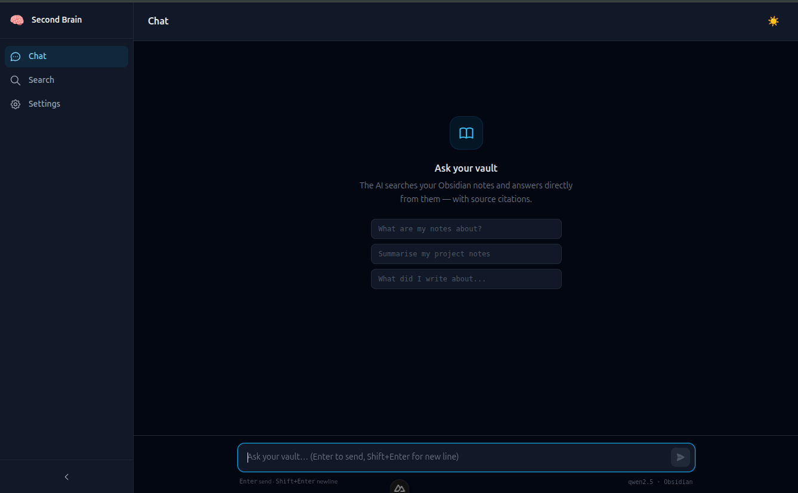

# MySecondBrain



A local-first, privacy-first **Retrieval-Augmented Generation (RAG)** system that turns an Obsidian markdown vault into a searchable, conversational knowledge base. It scans and chunks your notes, embeds and indexes them in a vector database, and answers questions grounded in your own content entirely on your own machine, with no data sent to third-party APIs.

This project was primarily built as a **learning project** to understand how to design and build a production-style RAG system end to end ingestion, chunking, embeddings, hybrid retrieval, prompt construction, LLM interaction, and evaluation  while following good software engineering practices (typed configuration, layered architecture, dependency injection, structured logging, security hardening, and test coverage).

## Built With

[](https://www.python.org/)
[](https://fastapi.tiangolo.com/)
[](https://qdrant.tech/)
[](https://ollama.com/)
[](https://vuejs.org/)
[](https://www.docker.com/)

## Features

- **Vault ingestion**  recursively scans an Obsidian vault, parses frontmatter, tags, headings, and wikilinks, and computes content hashes for change detection (`app/services/vault/`).
- **Heading-aware chunking**  a three-stage pipeline (section split → recursive split → overlap) turns markdown notes into retrieval-sized chunks (`app/services/ingestion/chunker.py`).
- **Local embeddings & generation**  uses Ollama for both embedding (`nomic-embed-text`) and chat generation (`qwen2.5` by default), so no external LLM API is required.
- **Hybrid retrieval**  combines Qdrant vector (semantic) search with an in-process BM25 keyword index, fused via weighted Reciprocal Rank Fusion (RRF), with per-note deduplication (`app/services/retrieval/`).
- **RAG chat**  blocking and Server-Sent-Events (SSE) streaming chat endpoints, with session-scoped conversation memory and cited note sources (`app/api/v1/endpoints/chat.py`).
- **Incremental sync**  hash-based diffing re-embeds only new/modified notes and removes stale vectors for deleted ones, tracked in a persisted state file (`app/services/indexing/`).
- **Security layer**  rate limiting (token bucket), input/output sanitization, and prompt-injection detection for both direct (user query) and indirect (malicious vault content) injection vectors, with audit logging (`app/services/security/`).
- **Operational readiness**  `/health` (liveness), `/readiness` (dependency checks), `/status` (component health) and `/models` endpoints; pre-flight startup validation; structured JSON logging; slow-request warnings.
- **Web UI**  a Nuxt 3 chat and semantic-search frontend (Vue 3 + Pinia + TailwindCSS) with streaming responses and source citations.
- **Dockerized stack**  dev and production Docker Compose configurations for Qdrant, Ollama, backend, and frontend, plus a backup script for Qdrant snapshots, vault, and index state.

## Architecture

```
Browser
  │
  └─► Nuxt 3 (port 3000)
          │
          └─► FastAPI (port 8000)
                  │
                  ├─► Qdrant (port 6333)   ← vector storage + search
                  └─► Ollama (port 11434)  ← embeddings + chat generation
```

All services run as Docker containers on a single bridge network, using Docker DNS for service discovery (`qdrant:6333`, `ollama:11434`, `backend:8000`).

See [docs/architecture.md](docs/architecture.md) for the full module map and the reasoning behind each design decision (why LlamaIndex, why Qdrant, why BM25 over sparse vectors, why RRF, etc.).

## Technology Stack

| Technology | Purpose | Why it was chosen |
|---|---|---|
| **Python 3.12** | Backend language | Modern typing features (`X \| Y` unions), required by `pyproject.toml` (`requires-python = ">=3.12"`). |
| **FastAPI** | Backend web framework | Async-native, automatic OpenAPI docs, first-class Pydantic integration for request/response validation. |
| **Pydantic v2 / pydantic-settings** | Data validation & configuration | Every setting is typed and validated at startup from environment variables  no `os.getenv()` scattered through business logic; enables an `is_production` flag for environment-specific behaviour. |
| **LlamaIndex** (`llama-index-core`, `llama-index-llms-ollama`) | RAG response synthesis | Chosen over LangChain for tighter scope and less abstraction overhead; used only for the final context-packing/answer-synthesis step  the retrieval pipeline itself is custom code. |
| **Qdrant** | Vector database | A proper server (REST + gRPC) with payload filtering, named vectors, and a snapshot API for backups  unlike Chroma (dev-only) or FAISS (no server mode). |
| **Ollama** | Local LLM/embedding runtime | Single-binary local model runtime, no GPU required for small models, models pulled like Docker images, HTTP API compatible with OpenAI-style clients  keeps the whole stack local-first. |
| **rank-bm25** | Keyword search | Lightweight in-process BM25 index; adequate for a personal vault (<50k chunks) without standing up a second search server or downloading a sparse-vector (SPLADE) model. |
| **Nuxt 3 / Vue 3** | Frontend framework | SSR-capable Vue meta-framework with file-based routing, auto-imports, and a mature ecosystem for a chat/search UI. |
| **Pinia** | Frontend state management | Official Vue store, used for chat, search, ingest, and UI state (`frontend/stores/`). |
| **TailwindCSS** | Frontend styling | Utility-first CSS for rapid, consistent UI development. |
| **httpx** | Async HTTP client (backend) | Async-native client used for all Ollama/Qdrant health probes and the custom Ollama service layer; connection pooling out of the box. |
| **pytest / pytest-asyncio** | Testing framework | Standard Python testing stack with native `async def` test support (`asyncio_mode = "auto"`). |
| **ruff** | Linting & formatting | Fast, single-tool replacement for flake8/isort/black, configured in `pyproject.toml`. |
| **mypy (strict)** | Static type checking | Strict mode catches type errors across the codebase before runtime. |
| **Docker / Docker Compose** | Containerization & orchestration | Reproducible dev and prod environments; named bridge network gives services DNS-based discovery; healthchecks gate startup ordering. |
| **uv** | Python package installer (in Docker image) | 10–100x faster, more deterministic installs than plain `pip` inside the backend Dockerfile. |
| **JSON structured logging** (custom `logging_config.py`) | Observability | JSON output for production log aggregators, human-readable console output for local dev; request-ID middleware correlates logs per request. |
| **Obsidian** | Source of truth for notes | The vault (`vault/`) is plain markdown, so it stays editable in Obsidian directly  the RAG system is additive, not a lock-in format. |


## Prerequisites

- **Python 3.12+** (backend requires `>=3.12`)
- **Node.js 22+** and npm (matches `node:22-alpine3.21` used in the frontend Docker image)
- **Docker & Docker Compose** (recommended path  runs Qdrant, Ollama, backend, and frontend together)
- **Ollama**  either the `ollama` service in Docker Compose, or a native install if running the backend outside Docker
- No external API keys are required  the project is fully local (Ollama for LLM/embeddings, Qdrant for vector storage). If you later swap in a hosted LLM provider, you would add its API key to the backend `.env`.
- An **Obsidian vault** (or any folder of markdown files) to ingest, placed at the path configured by `VAULT_PATH` (defaults to `./vault`)

## Installation

```bash
# 1. Clone the repository
git clone <repository-url>
cd second-brain   # or the cloned directory name

# 2. Backend: create a virtual environment and install dependencies
cd backend
python3.12 -m venv .venv
source .venv/bin/activate
pip install -r requirements/dev.txt   # includes base.txt (FastAPI, LlamaIndex, Qdrant, BM25) + test/lint tools

# 3. Frontend: install Node dependencies
cd ../frontend
npm install
```

## Configuration

Backend configuration is fully environment-driven via `pydantic-settings` (`backend/app/config/settings.py`), loaded from a `.env` file in `backend/`. Start from the provided template:

```bash
cd backend
cp .env.example .env
```

Key variable groups (see [backend/.env.example](backend/.env.example) for the full, commented list):

| Group | Variables | Notes |
|---|---|---|
| Application | `APP_NAME`, `ENVIRONMENT`, `DEBUG`, `API_PREFIX` | `ENVIRONMENT` gates `/docs` and `/redoc` (disabled in production) |
| Logging | `LOG_LEVEL`, `LOG_FORMAT` | `json` for aggregators, `console` for local dev |
| CORS | `ALLOWED_ORIGINS` | Must include the frontend origin (`http://localhost:3000` by default) |
| Qdrant | `QDRANT_HOST`, `QDRANT_PORT`, `QDRANT_COLLECTION` | Overridden to the Docker service name (`qdrant`) inside `docker-compose.yml` |
| Ollama | `OLLAMA_BASE_URL`, `OLLAMA_EMBED_MODEL`, `OLLAMA_CHAT_MODEL`, timeouts, retries | `OLLAMA_CHAT_MODEL` recommendations are documented inline (`qwen2.5`, `llama3.2`, `mistral`, `llama3.2:1b`) |
| Vault | `VAULT_PATH` | Path to the markdown vault to ingest |
| Incremental indexing | `INDEX_STATE_PATH`, `SYNC_INTERVAL_MINUTES` | `0` disables the background auto-sync scheduler |
| Hybrid search | `HYBRID_DEFAULT_MODE`, `HYBRID_SEMANTIC_WEIGHT`, `HYBRID_KEYWORD_WEIGHT`, `HYBRID_RRF_K` | Controls the RRF fusion between semantic and BM25 results |
| Ingestion | `CHUNK_SIZE`, `CHUNK_OVERLAP` | Passed to the markdown chunker |

The frontend reads a single public variable, `NUXT_PUBLIC_API_BASE` (set to `http://localhost:8000/api/v1` in `docker-compose.yml`), pointing it at the backend API.

No secrets or third-party API keys are required for the default local stack.

## Running the Project

### Option A  Docker Compose (recommended)

```bash
# Start everything: Qdrant, Ollama (+ one-shot model pull), backend, frontend
cd docker
docker compose up -d

# Production overrides (no --reload, optimized builds, resource limits):
docker compose -f docker-compose.yml -f docker-compose.prod.yml up -d
```

This brings up:
- Qdrant on `http://localhost:6333` (dashboard at `/dashboard`)
- Ollama on `http://localhost:11434` (models auto-pulled by the `ollama-init` one-shot service)
- Backend on `http://localhost:8000` (Swagger UI at `/docs` in dev)
- Frontend on `http://localhost:3000`

### Option B  Run services manually

```bash
# 1. Start Qdrant and Ollama (via Docker or native installs)
cd docker && docker compose up qdrant ollama -d

# 2. Pull the required Ollama models
./scripts/pull_models.sh   # nomic-embed-text + llama3.2

# 3. Start the backend
cd backend
source .venv/bin/activate
uvicorn app.main:app --reload --port 8000

# 4. Start the frontend
cd frontend
npm run dev
```

### Ingesting your vault

Once the backend is running, index your notes:

```bash
# Preview what will be scanned (read-only, no writes)
curl -X POST http://localhost:8000/api/v1/ingest/scan

# Preview the chunking output before embedding
curl -X POST http://localhost:8000/api/v1/ingest/preview

# Run the full ingestion pipeline (scan → chunk → embed → index)
curl -X POST http://localhost:8000/api/v1/ingest

# Re-index only new/changed/deleted notes (faster, hash-based diff)
curl -X POST http://localhost:8000/api/v1/ingest/sync
```

### Using the RAG pipeline

```bash
# Hybrid search
curl "http://localhost:8000/api/v1/search?q=your+question&top_k=10"

# RAG chat (grounded answer with cited sources)
curl -X POST http://localhost:8000/api/v1/chat/rag \
  -H "Content-Type: application/json" \
  -d '{"session_id": "demo", "messages": [{"role": "user", "content": "your question"}]}'
```

For a full catalog of ready-to-run requests (method, URL, request body, and which
part of the system each one exercises — ingestion, hybrid search, plain chat, RAG
chat, streaming, sessions, security) see [docs/API_TESTING.md](docs/API_TESTING.md).

Or use the Nuxt UI at `http://localhost:3000` for chat and semantic search.

## Running Tests

Tests live in `backend/tests/`, mirroring `backend/app/services/` (e.g. `tests/services/retrieval/` for `app/services/retrieval/`), plus `tests/unit/` for standalone modules like `startup.py`. There is a `tests/integration/` directory scaffolded for future end-to-end tests against live Qdrant/Ollama instances; it is currently empty  all 500+ existing tests are fast, isolated unit tests that mock external services.

```bash
cd backend
source .venv/bin/activate

# Run the full suite
pytest

# Run a specific test file
pytest tests/services/retrieval/test_engine.py -v

# Run a single test
pytest tests/services/retrieval/test_engine.py::TestRetrievalEngine::test_hybrid_mode -v

# Run all tests for one service area
pytest tests/services/indexing/ -v
```

`asyncio_mode = "auto"` is set in `pyproject.toml`, so `async def test_*` functions work without extra decorators.

## Development

```bash
cd backend
source .venv/bin/activate

# Lint + format (ruff), configured in pyproject.toml (line-length 100, py312 target)
ruff check .
ruff format .

# Static type checking (mypy strict mode)
mypy app
```

Frontend:

```bash
cd frontend
npm run lint        # eslint over .vue/.ts/.tsx
npm run typecheck   # nuxt typecheck (vue-tsc)
```

No pre-commit hooks or code-generation steps are configured in this repository.

## Learning Goals

This project exists to build hands-on, practical understanding of how a RAG system is designed and put together in production-style code, including:

- **Document ingestion** : recursively scanning a real-world document source (an Obsidian vault) and parsing structured metadata (frontmatter, tags, headings, wikilinks).
- **Chunking** : splitting documents into retrieval-sized units while preserving heading context and controlling overlap.
- **Embeddings** : generating vector representations locally via Ollama, batched for throughput.
- **Vector search** : storing and querying embeddings in a purpose-built vector database (Qdrant).
- **Retrieval** : combining semantic (vector) and lexical (BM25) search via Reciprocal Rank Fusion, with deduplication and relevance filtering.
- **Prompt construction** : assembling system instructions, conversation history, and retrieved context into an LLM prompt within a token budget.
- **LLM interaction** : both blocking and streaming (SSE) generation, plus local model orchestration via Ollama.
- **Evaluation** : chunking/retrieval preview endpoints (`/ingest/preview`, `/search`) to inspect pipeline output before trusting it end to end.
- **Production-oriented project structure** : layered service architecture, dependency injection (`app/dependencies.py`), typed configuration, structured logging, startup validation, health/readiness probes, rate limiting, and prompt-injection defenses.

## Future Improvements

Based on the current implementation, reasonable next steps include:

- Implement the currently-empty `tests/integration/` suite against live Qdrant/Ollama containers.
- Add an ESLint configuration file for the frontend (`npm run lint` currently has no committed `eslint.config.*`).
- Add CI (no GitHub Actions or other CI configuration currently exists in this repository).
- Persist conversation sessions (currently in-memory only, lost on backend restart) to a lightweight store such as SQLite or Redis.
- Add retrieval/answer quality evaluation (e.g. a golden Q&A set with automated scoring) to track regressions as chunking/retrieval parameters change.
- Support additional embedding providers/models behind the existing `EmbeddingProvider` abstraction for easier experimentation.
- Add authentication if the API is ever exposed beyond localhost (currently designed for single-user, local use).

